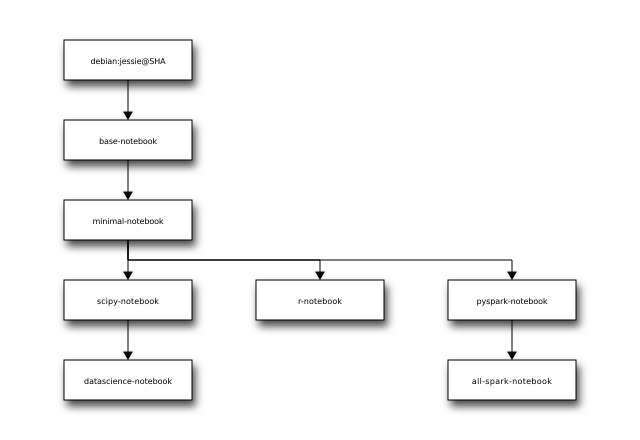

#Analytics-Dojo Docker Stacks

This repository contains customized version of the docker-stacks repository.  We thank the jupyter team for the amazing work in creating them. 


# docker-stacks

[](https://travis-ci.org/jupyter/docker-stacks)
[](https://gitter.im/jupyter/jupyter?utm_source=badge&utm_medium=badge&utm_campaign=pr-badge&utm_content=badge)

Opinionated stacks of ready-to-run Jupyter applications in Docker.

## Quick Start

If you're familiar with Docker, have it configured, and know exactly what you'd like to run, this one-liner should work in most cases:

```
docker run -d -P jupyter/<your desired stack>
```

## Getting Started

If this is your first time using Docker or any of the Jupyter projects, do the following to get started.

1. [Install Docker](https://docs.docker.com/installation/) on your host of choice.
2. Open the README in one of the folders in this git repository.
3. Follow the README for that stack.

## Visual Overview

Here's a diagram of the `FROM` relationships between all of the images defined in this project:

[](http://interactive.blockdiag.com/?compression=deflate&encoding=base64&src=eJyFzLEOwjAMRdGdr7C6d0dURXRjZ0QIOY2LTNM4SsxQEP9Ow5YuXe87tnHSj5bxAZ8dgEQmr6gsHloIEjUia7MslgZ8Ob0P4jXxm5Z5n3sHV4eGXFtZMoz-8KSUmE6Xc1fdmt1f1EcwmKj2omRExnxXhCwm9jyhK9C6ZZd6DnOhypKNRcWlku9p81_c-BXmFDCOhVq37NC5ei2_P_VBd-Y)

## Stacks, Tags, Versioning, and Progress

Starting with [git commit SHA 9bd33dcc8688](https://github.com/jupyter/docker-stacks/tree/9bd33dcc8688):

* Nearly every folder here on GitHub has an equivalent `jupyter/<stack name>` on Docker Hub (e.g., all-spark-notebook &rarr; jupyter/all-spark-notebook).
* The `latest` tag in each Docker Hub repository tracks the `master` branch `HEAD` reference on GitHub.
* Any 12-character image tag on Docker Hub refers to a git commit SHA here on GitHub. See the [Docker build history wiki page](https://github.com/jupyter/docker-stacks/wiki/Docker-build-history) for a table of build details.
* Stack contents (e.g., new library versions) will be updated upon request via PRs against this project.
* Users looking to remain on older builds should refer to specific git SHA tagged images in their work, not `latest`.
* For legacy reasons, there are two additional tags named `3.2` and `4.0` on Docker Hub which point to images prior to our versioning scheme switch.

## Other Tips and Known Issues

* `tini -- start-notebook.sh` is the default Docker entrypoint-plus-command in every notebook stack. If you plan to modify it in any way, be sure to check the *Notebook Options* section of your stack's README to understand the consequences.
* Every notebook stack is compatible with [JupyterHub](https://jupyterhub.readthedocs.org) 0.5.  When running with JupyterHub, you must override the Docker run command to point to the [start-singleuser.sh](base-notebook/start-singleuser.sh) script, which starts a single-user instance of the Notebook server.  See each stack's README for instructions on running with JupyterHub.
* Check the [Docker recipes wiki page](https://github.com/jupyter/docker-stacks/wiki/Docker-Recipes) attached to this project for information about extending and deploying the Docker images defined here. Add to the wiki if you have relevant information.
* All stacks that derive from minimal-notebook have the conda jpeg package pinned to version 8 until https://github.com/jupyter/docker-stacks/issues/210 is resolved upstream.

## Maintainer Workflow

**For PRs that impact the definition of one or more stacks, do the following:**

1. Make sure Travis is green.
2. Merge the PR.
3. `ssh -i ~/.ssh/your-github-key build@docker-stacks.cloudet.xyz`
4. Run these commands on that VM.

```
# join the shared tmux session
tmux a
cd docker-stacks
# make sure we're always on clean master from github
git fetch origin
git reset --hard origin/master
# retry on failure up to 10 times with a (60 * iteration)
# second delay in-between
make retry/release-all
```

When `make retry/release-all` successfully pushes the last of its images to Docker Hub (currently `jupyter/all-spark-notebook`), Docker Hub invokes [the webhook](https://github.com/jupyter/docker-stacks/blob/master/internal/docker-stacks-webhook/) which updates the [Docker build history](https://github.com/jupyter/docker-stacks/wiki/Docker-build-history) wiki page.

**When there's a security fix in the Debian base image, do the following in place of the last command:**

Update the `debian:jessie` SHA in the most-base images (e.g., base-notebook). Submit it as a regular PR and go through the build process.

This will take time as the entire set of stacks will rebuild.

**When there's a new stack, do the following before trying to `make rety/release-all`:**

1. Create a new repo in the `jupyter` org on Docker Hub named after the stack folder in the git repo.
2. Grant the `stacks` team permission to write to the repo.
3. Copy/paste the short and long descriptions from one of the other docker-stacks repos on Docker Hub. Modify the appropriate values.

**When there's a new maintainer, do the following:**

1. Add the GitHub user to the Jupyter org, *Docker image maintainers* team.
2. Get the GitHub user's public key from https://github.com/<USERNAME>.keys.
3. `ssh -i ~/.ssh/your-github-key build@docker-stacks.cloudet.xyz`
4. Add the user's public key to `~/.ssh/authorized_keys` with his/her GitHub username as the comment after the key.
