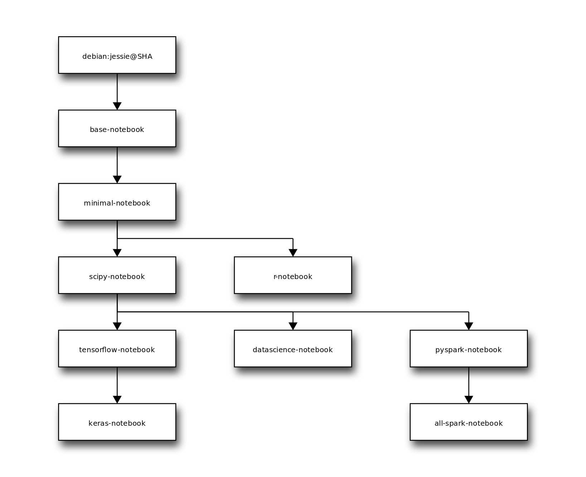

# docker-stacks

[](https://travis-ci.org/jupyter/docker-stacks)
[](https://gitter.im/jupyter/jupyter?utm_source=badge&utm_medium=badge&utm_campaign=pr-badge&utm_content=badge)

Opinionated stacks of ready-to-run Jupyter applications in Docker.

## Quick Start

If you're familiar with Docker, have it configured, and know exactly what you'd like to run, this one-liner should work in most cases:

```
docker run -d -P jupyter/<your desired stack>
```

## Getting Started

If this is your first time using Docker or any of the Jupyter projects, do the following to get started.

1. [Install Docker](https://docs.docker.com/installation/) on your host of choice.
2. Open the README in one of the folders in this git repository.
3. Follow the README for that stack.

## Visual Overview

Here's a diagram of the `FROM` relationships between all of the images defined in this project:

[](http://interactive.blockdiag.com/?compression=deflate&src=eJyFzbEOgkAMgOGdp7iwsxsJRjZ3R2NMjyumcrTkrsag8d3l3I6F9e_X1nrpBkdwN5_CGAmErKAkbBozSdAApPUycdjD0-utF9ZIb1zGu9Rbc_Fg0TelQ0vA-wfGSHg8n9ryWhd_UR2MhYgVi6IVGdJeFpIYiWkEn6F1Sy52NM2Zyksyihwl9F5eG9CBwlKRO9x8HDZuTXOcIAyZWrfkwPtqLb8_jh2GrQ)

## Stacks, Tags, Versioning, and Progress

Starting with [git commit SHA 9bd33dcc8688](https://github.com/jupyter/docker-stacks/tree/9bd33dcc8688):

* Nearly every folder here on GitHub has an equivalent `jupyter/<stack name>` on Docker Hub (e.g., all-spark-notebook &rarr; jupyter/all-spark-notebook).
* The `latest` tag in each Docker Hub repository tracks the `master` branch `HEAD` reference on GitHub.
* Any 12-character image tag on Docker Hub refers to a git commit SHA here on GitHub. See the [Docker build history wiki page](https://github.com/jupyter/docker-stacks/wiki/Docker-build-history) for a table of build details.
* Stack contents (e.g., new library versions) will be updated upon request via PRs against this project.
* Users looking to remain on older builds should refer to specific git SHA tagged images in their work, not `latest`.
* For legacy reasons, there are two additional tags named `3.2` and `4.0` on Docker Hub which point to images prior to our versioning scheme switch.

## Other Tips and Known Issues

* Python 2.x was [removed from all images](https://github.com/jupyter/docker-stacks/pull/433) on August 10th, 2017, starting in tag `cc9feab481f7`. If you wish to continue using Python 2.x, pin to tag `82b978b3ceeb`.
* `tini -- start-notebook.sh` is the default Docker entrypoint-plus-command in every notebook stack. If you plan to modify it in any way, be sure to check the *Notebook Options* section of your stack's README to understand the consequences.
* Every notebook stack is compatible with [JupyterHub](https://jupyterhub.readthedocs.io) 0.5 or higher.  When running with JupyterHub, you must override the Docker run command to point to the [start-singleuser.sh](base-notebook/start-singleuser.sh) script, which starts a single-user instance of the Notebook server.  See each stack's README for instructions on running with JupyterHub.
* Check the [Docker recipes wiki page](https://github.com/jupyter/docker-stacks/wiki/Docker-Recipes) attached to this project for information about extending and deploying the Docker images defined here. Add to the wiki if you have relevant information.
* The pyspark-notebook and all-spark-notebook stacks will fail to submit Spark jobs to a Mesos cluster when run on Mac OSX due to https://github.com/docker/for-mac/issues/68.

## Maintainer Workflow

**To build new images on Docker Cloud and publish them to the Docker Hub registry, do the following:**

1. Make sure Travis is green for a PR.
2. Merge the PR.
3. Monitor the Docker Cloud build status for each of the stacks, starting with [jupyter/base-notebook](https://cloud.docker.com/app/jupyter/repository/docker/jupyter/base-notebook/general) and ending with [jupyter/all-spark-notebook](https://cloud.docker.com/app/jupyter/repository/docker/jupyter/all-spark-notebook/general).
    * See the stack hierarchy diagram for the current, complete build order.
4. Manually click the retry button next to any build that fails to resume that build and any dependent builds.
5. Avoid merging another PR to master until all outstanding builds complete.
    * There's no way at present to propagate the git SHA to build through the Docker Cloud build trigger API. Every build trigger works off of master HEAD.

**When there's a security fix in the Ubuntu base image, do the following in place of the last command:**

Update the `ubuntu:16.04` SHA in the most-base images (e.g., base-notebook). Submit it as a regular PR and go through the build process. Expect the build to take a while to complete: every image layer will rebuild.

**When there's a new stack definition, do the following before merging the PR with the new stack:**

1. Ensure the PR includes an update to the stack overview diagram in the top-level README.
    * The source of the diagram is included in the alt-text of the image. Visit that URL to make edits.
2. Ensure the PR updates the Makefile which is used to build the stacks in order on Travis CI.
3. Create a new repoistory in the `jupyter` org on Docker Cloud named after the stack folder in the git repo.
4. Grant the `stacks` team permission to write to the repo.
5. Click *Builds* and then *Configure Automated Builds* for the repository.
6. Select `jupyter/docker-stacks` as the source repository.
7. Choose *Build on Docker Cloud's infrastructure using a Small node* unless you have reason to believe a bigger host is required.
8. Update the *Build Context* in the default build rule to be `/<name-of-the-stack>`.
9. Toggle *Autobuild* to disabled unless the stack is a new root stack (e.g., like `jupyter/base-notebook`).
10. If the new stack depends on the build of another stack in the hierarchy:
    1. Hit *Save* and then click *Configure Automated Builds*.
    2. At the very bottom, add a build trigger named *Stack hierarchy trigger*.
    3. Copy the build trigger URL.
    4. Visit the parent repository *Builds* page and click *Configure Automated Builds*.
    5. Add the URL you copied to the *NEXT_BUILD_TRIGGERS* environment variable comma separated list of URLs, creating that environment variable if it does not already exist.
    6. Hit *Save*.
11. If the new stack should trigger other dependent builds:
    1. Add an environment variable named *NEXT_BUILD_TRIGGERS*.
    2. Copy the build trigger URLs from the dependent builds into the *NEXT_BUILD_TRIGGERS* comma separated list of URLs.
    3. Hit *Save*.
12. Adjust other *NEXT_BUILD_TRIGGERS* values as needed so that the build order matches that in the stack hierarchy diagram.

**When there's a new maintainer, do the following:**

1. Visit https://cloud.docker.com/app/jupyter/team/stacks/users
2. Add the new maintainer user name.

**If automated builds have got you down, do the following:**

1. Clone this repository.
2. Check out the git SHA you want to build and publish.
3. `docker login` with your Docker Hub/Cloud credentials.
4. Run `make retry/release-all`.

When `make retry/release-all` successfully pushes the last of its images to Docker Hub (currently `jupyter/all-spark-notebook`), Docker Hub invokes [the webhook](https://github.com/jupyter/docker-stacks/blob/master/internal/docker-stacks-webhook/) which updates the [Docker build history](https://github.com/jupyter/docker-stacks/wiki/Docker-build-history) wiki page.
