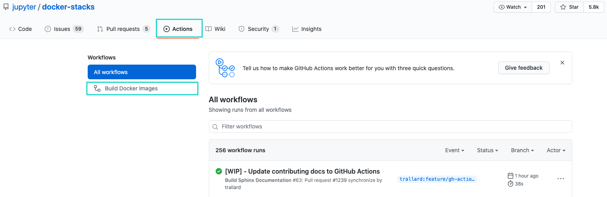
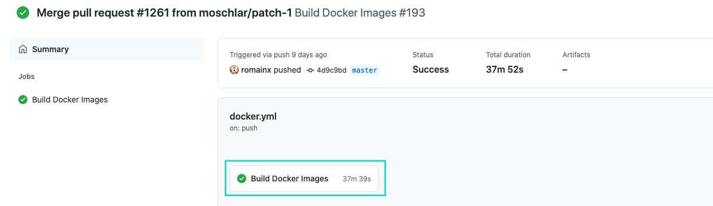
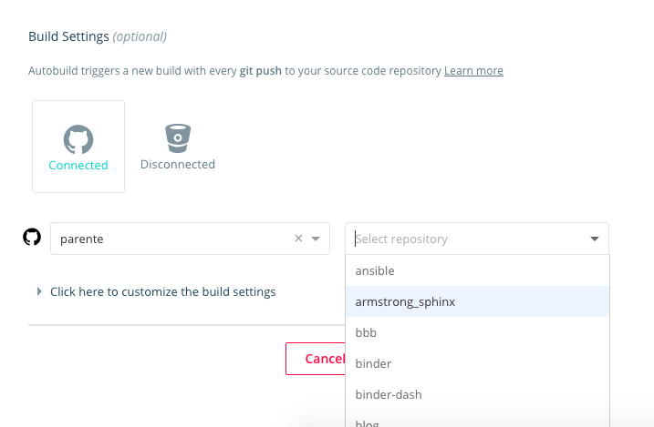
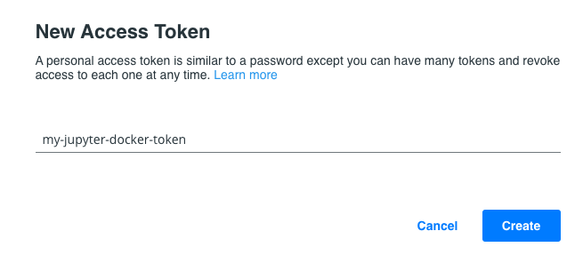
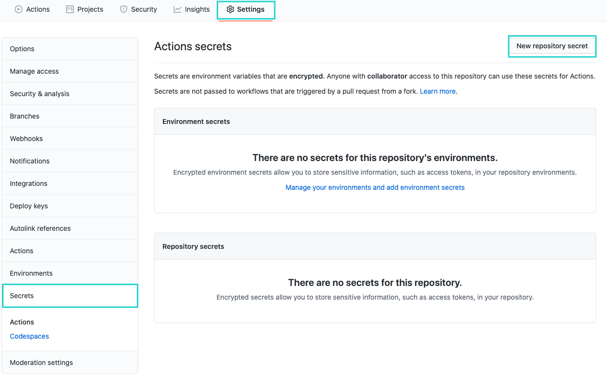
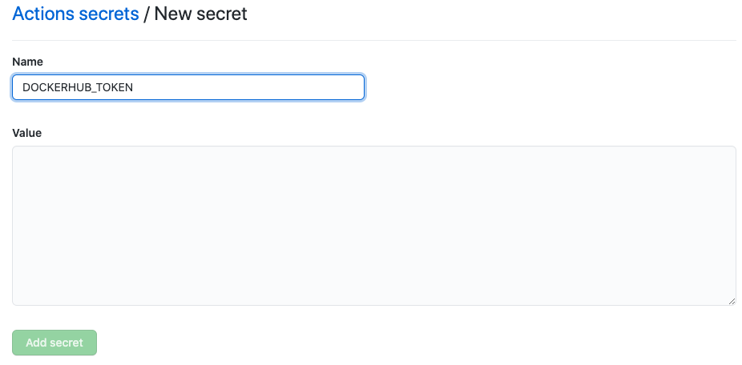
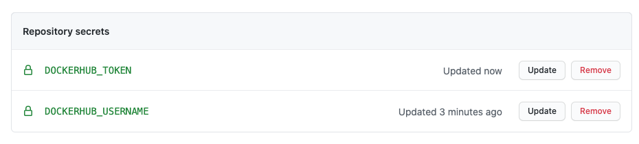

# Community Stacks

We love to see the community create and share new Jupyter Docker images.
We've put together a [cookiecutter project](https://github.com/jupyter/cookiecutter-docker-stacks)
and the documentation below to help you get started defining, building, and sharing your Jupyter environments in Docker.

Following these steps will:

1. Set up a project on GitHub containing a Dockerfile based on any image we provide.
2. Configure GitHub Actions to build and test your image when users submit pull requests to your repository.
3. Configure Docker Hub to build and host your images for others to use.
4. Update the [list of community stacks](../using/selecting.md#community-stacks) in this documentation to include your image.

This approach mirrors how we build and share the core stack images.
Feel free to follow it or pave your own path using alternative services and build tools.

## Creating a Project

First, install [cookiecutter](https://github.com/cookiecutter/cookiecutter) using _pip_ or _conda_:

```bash
pip install cookiecutter  # or mamba install cookiecutter
```

Run the cookiecutter command pointing to the [jupyter/cookiecutter-docker-stacks](https://github.com/jupyter/cookiecutter-docker-stacks) project on GitHub.

```bash
cookiecutter https://github.com/jupyter/cookiecutter-docker-stacks.git
```

Enter a name for your new stack image.
This will serve as both the git repository name and the part of the Docker image name after the slash.

```text
stack_name [my-jupyter-stack]:
```

Enter the user or organization name under which this stack will reside on Docker Hub.
You must have access to manage this Docker Hub organization to push images here and set up automated builds.

```text
stack_org [my-project]:
```

Select an image from the jupyter/docker-stacks project that will serve as the base for your new image.

```text
stack_base_image [jupyter/base-notebook]:
```

Enter a longer description of the stack for your README.

```text
stack_description [my-jupyter-stack is a community-maintained Jupyter Docker Stack image]:
```

Initialize your project as a Git repository and push it to GitHub.

```bash
cd <stack_name you chose>

git init
git add .
git commit -m 'Seed repo'
git remote add origin <url from github>
git push -u origin main
```

## Configuring GitHub actions

The cookiecutter template comes with a `.github/workflows/docker.yml` file, which allows you to use GitHub actions to build your Docker image whenever you or someone else submits a pull request.

1. By default, the `.github/workflows/docker.yaml` file has the following triggers configuration:

   ```yaml
   on:
   pull_request:
     paths-ignore:
       - "*.md"
   push:
     branches:
       - main
     paths-ignore:
       - "*.md"
   ```

   This will trigger the CI pipeline whenever you push to your `main` branch and when any Pull Requests are made to your repository.
   For more details on this configuration, visit the [GitHub actions documentation on triggers](https://docs.github.com/en/actions/using-workflows/events-that-trigger-workflows).

2. Commit your changes and push them to GitHub.
3. Head back to your repository and click on the **Actions** tab.
   
   From there, you can click on the workflows on the left-hand side of the screen.
4. In the next screen, you will see information about the workflow run and duration.
   If you click the button with the workflow name again, you will see the logs for the workflow steps.
   

## Configuring Docker Hub

Now, configure Docker Hub to build your stack image and push it to the Docker Hub repository whenever
you merge a GitHub pull request to the main branch of your project.

1. Visit [https://hub.docker.com/](https://hub.docker.com/) and log in.
2. Select the account or organization matching the one you entered when prompted with `stack_org` by the cookiecutter.
   
3. Scroll to the bottom of the page and click **Create repository**.
4. Enter the name of the image matching the one you entered when prompted with `stack_name` by the cookiecutter.
   
5. Enter a description for your image.
6. Click **GitHub** under the **Build Settings** and follow the prompts to connect your account if it is not already connected.
7. Select the GitHub organization and repository containing your image definition from the dropdowns.
   
8. Click the **Create and Build** button.
9. Click on your avatar in the top-right corner and select Account settings.
   
10. Click on **Security** and then click on the **New Access Token** button.
    
11. Enter a meaningful name for your token and click on **Create**
    
12. Copy the personal access token displayed on the next screen.

    ```{note}
    you will not be able to see it again after you close the pop-up window**.
    ```

13. Head back to your GitHub repository and click on the **Settings tab**.
    
14. Click on the **Secrets** section and then on the **New repository secret** button in the top right corner (see image above).
15. Create a **DOCKERHUB_TOKEN** secret and paste the Personal Access Token from DockerHub in the **value** field.
    
16. Repeat the above step but creating a **DOCKERHUB_USERNAME** and replacing the _value_ field with your DockerHub username.
    Once you have completed these steps, your repository secrets section should look something like this:
    

## Defining Your Image

Make edits to the Dockerfile in your project to add third-party libraries and configure Jupyter
applications.
Refer to the Dockerfiles for the core stacks (e.g., [jupyter/datascience-notebook](https://github.com/jupyter/docker-stacks/blob/main/datascience-notebook/Dockerfile))
to get a feel for what's possible and the best practices.

[Submit pull requests](https://github.com/PointCloudLibrary/pcl/wiki/A-step-by-step-guide-on-preparing-and-submitting-a-pull-request)
to your project repository on GitHub.
Ensure your image builds correctly on GitHub actions before merging to the main branch.
Refer to Docker Hub to build the main branch that you can `docker pull`.

## Sharing Your Image

Finally, if you'd like to add a link to your project to this documentation site, please do the following:

1. Clone the [jupyter/docker-stacks](https://github.com/jupyter/docker-stacks) GitHub repository.
2. Open the `docs/using/selecting.md` source file and locate the **Community Stacks** section.
3. Add a table entry with a link to your project, a binder link and a short description of what your Docker image contains.
4. [Submit a pull request](https://github.com/PointCloudLibrary/pcl/wiki/A-step-by-step-guide-on-preparing-and-submitting-a-pull-request)(PR) with your changes.
   Maintainers will respond and work with you to address any formatting or content issues.
