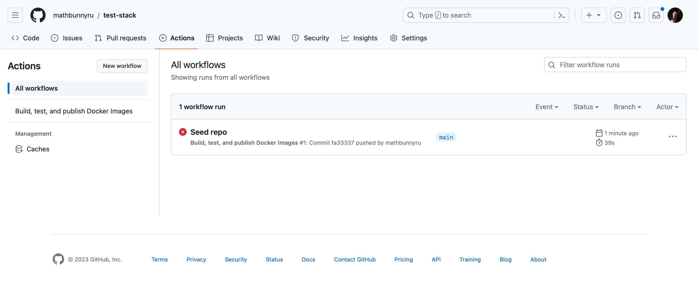
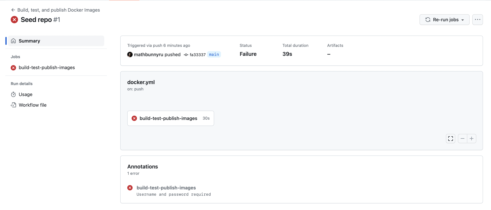
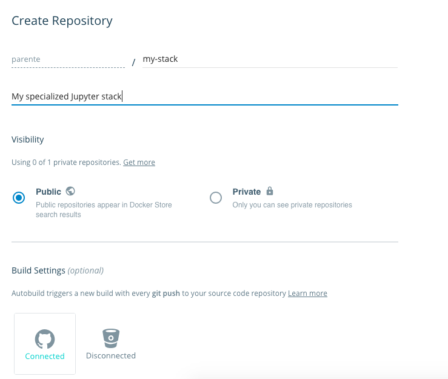
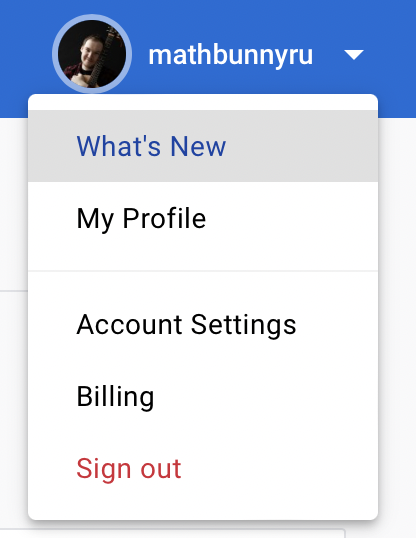
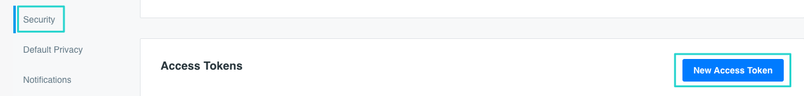
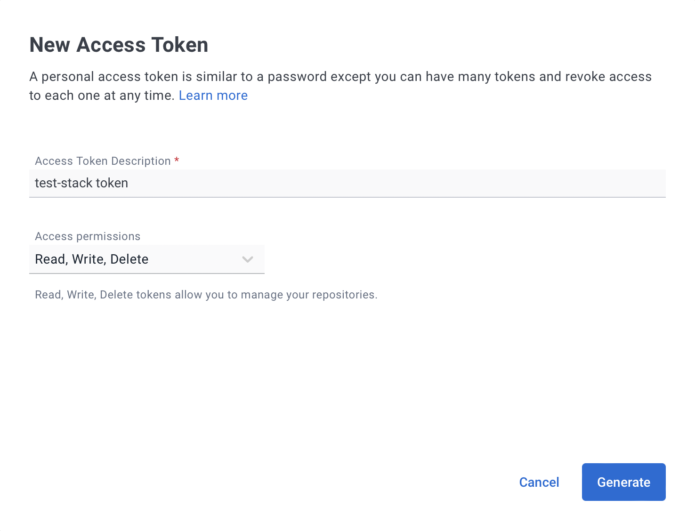
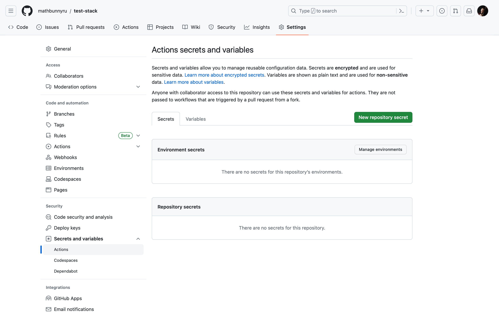
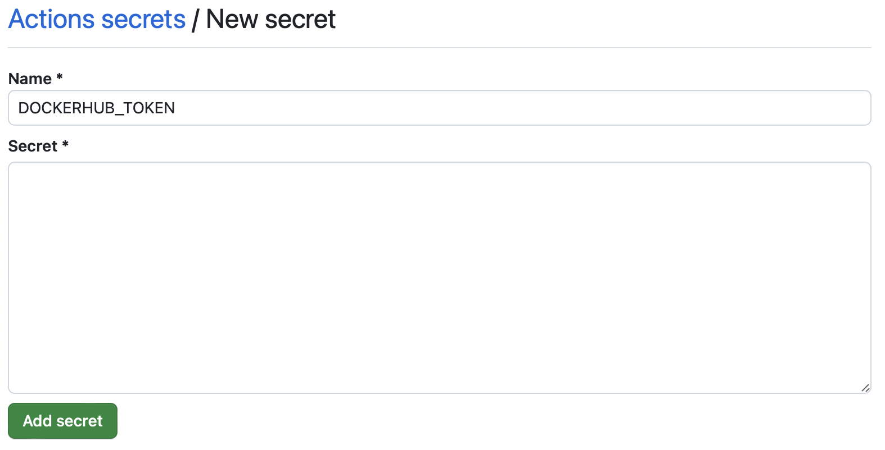

# Community Stacks

We love to see the community create and share new Jupyter Docker images.
We've put together a [cookiecutter project](https://github.com/jupyter/cookiecutter-docker-stacks)
and the documentation below to help you get started defining, building, and sharing your Jupyter environments in Docker.

Following these steps will:

1. Set up a project on GitHub containing a Dockerfile based on any image we provide.
2. Configure GitHub Actions to build and test your image when users submit pull requests to your repository.
3. Configure Quay.io to host your images for others to use.
4. Update the [list of community stacks](../using/selecting.md#community-stacks) in this documentation to include your image.

This approach mirrors how we build and share the core stack images.
Feel free to follow it or pave your own path using alternative services and build tools.

## Creating a Project

First, install [cookiecutter](https://github.com/cookiecutter/cookiecutter) using _pip_ or _mamba_:

```bash
pip install cookiecutter  # or mamba install cookiecutter
```

Run the cookiecutter command pointing to the [jupyter/cookiecutter-docker-stacks](https://github.com/jupyter/cookiecutter-docker-stacks) project on GitHub.

```bash
cookiecutter https://github.com/jupyter/cookiecutter-docker-stacks.git
```

Enter a name for your new stack image.
This will serve as both the git repository name and the part of the Docker image name after the slash.

```text
stack_name [my-jupyter-stack]:
```

Enter the user or organization name under which this stack will reside on Quay.io.
You must have access to manage this Quay.io organization to push images here.

```text
stack_org [my-project]:
```

Select an image from the `jupyter/docker-stacks` project that will serve as the base for your new image.

```text
stack_base_image [quay.io/jupyter/base-notebook]:
```

Enter a longer description of the stack for your README.

```text
stack_description [my-jupyter-stack is a community-maintained Jupyter Docker Stack image]:
```

Create a GitHub repository to store your project.
Initialize your project as a Git repository and push it to GitHub.

```bash
cd <stack_name you chose>

git init
git add .
git commit -m 'Seed repo'
git remote add origin <url from github>
git push -u origin main
```

## Exploring GitHub Actions

1. By default, the newly `.github/workflows/docker.yaml` will trigger the CI pipeline whenever you push to your `main` branch
   and when any Pull Requests are made to your repository.
   For more details on this configuration, visit the [GitHub actions documentation on triggers](https://docs.github.com/en/actions/using-workflows/events-that-trigger-workflows).

2. Go to your repository and click on the **Actions** tab.
   From there, you can click on the workflows on the left-hand side of the screen.

   

   ```{note}
   First run is expected to fail, because we haven't yet added Docker credentials to push the image
   ```

3. In the next screen, you will see information about the workflow run and duration.
   If you click the button with the workflow name again, you will see the logs for the workflow steps.

   

## Configuring Docker Hub

```{note}
Jupyter Docker Stacks are hosted on Quay.io, but in this example, we show you how to host your image on Docker Hub.
```

Now, configure Docker Hub to build your stack image and push it to the Docker Hub repository whenever
you merge a GitHub pull request to the main branch of your project.

1. Visit [https://hub.docker.com/](https://hub.docker.com/) and log in.
2. Create a new repository - make sure to use the correct namespace (account or organization).
   Enter the name of the image matching the one you entered when prompted with `stack_name` by the cookiecutter.

   

3. Enter a description for your image.
4. Click on your avatar in the top-right corner and select Account settings.

   

5. Click on **Security** and then click on the **New Access Token** button.

   

6. Enter a meaningful name for your token and click on **Generate**

   

7. Copy the personal access token displayed on the next screen.

   ```{note}
   **You will not be able to see it again after you close the pop-up window**.
   ```

8. Head back to your GitHub repository and click on the **Settings tab**.
9. Click on the **Secrets and variables->Actions** section and then on the **New repository secret** button in the top right corner.

   

10. Create a **DOCKERHUB_TOKEN** secret and paste the Personal Access Token from Docker Hub in the **value** field.

    

11. Now you're ready to go and you can restart a failed workflow.

## Defining Your Image

Make edits to the Dockerfile in your project to add third-party libraries and configure Jupyter applications.
Refer to the Dockerfiles for the core stacks (e.g., [jupyter/datascience-notebook](https://github.com/jupyter/docker-stacks/blob/main/images/datascience-notebook/Dockerfile))
to get a feel for what's possible and the best practices.

[Submit pull requests](https://github.com/PointCloudLibrary/pcl/wiki/A-step-by-step-guide-on-preparing-and-submitting-a-pull-request)
to your project repository on GitHub.
Ensure your image builds correctly on GitHub Actions before merging to the main branch.
After merging to the main branch, your image will be built and pushed to the Docker Hub automatically.

## Sharing Your Image

Finally, if you'd like to add a link to your project to this documentation site, please do the following:

1. Fork the [jupyter/docker-stacks](https://github.com/jupyter/docker-stacks) GitHub repository.
2. Open the `docs/using/selecting.md` source file and locate the **Community Stacks** section in your fork.
3. Add a table entry with a link to your project, a binder link and a short description of what your Docker image contains.
4. [Submit a pull request](https://github.com/PointCloudLibrary/pcl/wiki/A-step-by-step-guide-on-preparing-and-submitting-a-pull-request)(PR) with your changes.
   Maintainers will respond and work with you to address any formatting or content issues.
