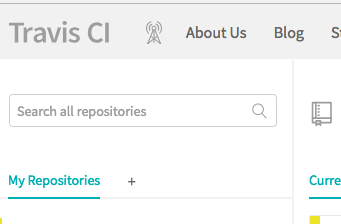
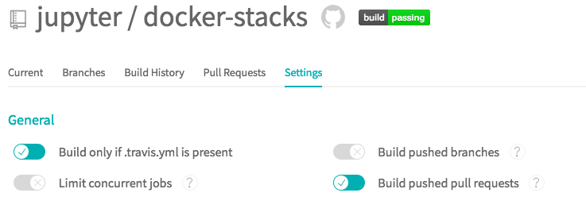

# Community Stacks

We love to see the community create and share new Jupyter Docker images. We've put together a [cookiecutter project](https://github.com/jupyter/cookiecutter-docker-stacks) and the documentation below to help you get started defining, building, and sharing your Jupyter environments in Docker. Following these steps will:

1. Setup a project on GitHub containing a Dockerfile based on either the `jupyter/base-notebook` or `jupyter/minimal-notebook` image.
2. Configure Travis CI to build and test your image when users submit pull requests to your repository.
3. Configure Docker Cloud to build and host your images for others to use.
4. Update the [list of community stacks](../using/selecting.html#community-stacks) in this documentation to include your image.

This approach mirrors how we build and share the core stack images. Feel free to follow it or pave your own path using alternative services and build tools.

## Creating a Project

First, install [cookiecutter](https://github.com/audreyr/cookiecutter) using pip or conda:

```
pip install cookiecutter   # or conda install cookiecutter
```

Run the cookiecutter command pointing to the [jupyter/cookiecutter-docker-stacks](https://github.com/jupyter/cookiecutter-docker-stacks) project on GitHub.

```
cookiecutter https://github.com/jupyter/cookiecutter-docker-stacks.git
```

Enter a name for your new stack image. This will serve as both the git repository
name and the part of the Docker image name after the slash.

```
stack_name [my-jupyter-stack]:
```

Enter the user or organization name under which this stack will reside on
Docker Cloud / Hub. You must have access to manage this Docker Cloud org in
order to push images here and setup automated builds.

```
stack_org [my-project]:
```

Select an image from the jupyter/docker-stacks project that will serve as the
base for your new image.

```
stack_base_image [jupyter/base-notebook]:
```

Enter a longer description of the stack for your README.

```
stack_description [my-jupyter-stack is a community maintained Jupyter Docker Stack image]:
```

Initialize your project as a Git repository and push it to GitHub.

```
cd <stack_name you chose>

git init
git add .
git commit -m 'Seed repo'
git remote add origin <url from github>
git push -u origin master
```

## Configuring Travis

Next, link your GitHub project to Travis CI to build your Docker image whenever you or someone else submits a pull request.

1. Visit [https://docs.travis-ci.com/user/getting-started/#To-get-started-with-Travis-CI](https://docs.travis-ci.com/user/getting-started/#To-get-started-with-Travis-CI) and follow the instructions to add the Travis CI application to your GitHub account.
3. Visit [https://travis-ci.org](https://travis-ci.org).
4. Click the + symbol at the top of the left sidebar.
    
5. Locate your project repository either in your primary user account or in one of the organizations to which you belong.
6. Click the toggle to enable builds for the project repository.
7. Click the **Settings** button for that repository.
    
8. Enable **Build only if .travis.yml is present** and **Build pushed pull requests**.
    
9. Disable **Build pushed branches**.

## Configuring Docker Cloud

Now, configure Docker Cloud to build your stack image and push it to Docker Hub repository whenever you merge a GitHub pull request to the master branch of your project.

1. Visit [https://cloud.docker.com/](https://cloud.docker.com/) and login.
2. Select the account or organization matching the one you entered when prompted with `stack_org` by the cookiecutter.
    
3. Scroll to the bottom of the page and click **Create repository**.
4. Enter the name of the image matching the one you entered when prompted with `stack_name` by the cookiecutter.
    
5. Enter a description for your image.
6. Click **GitHub** under the **Build Settings** and follow the prompts to connect your account if it is not already connected.
7. Select the GitHub organization and repository containing your image definition from the dropdowns.
    
8. Click the **Create and Build** button.

## Defining Your Image

Make edits the Dockerfile in your project to add third-party libraries and configure Jupyter applications. Refer to the Dockerfiles for the core stacks (e.g., [jupyter/datascience-notebook](https://github.com/jupyter/docker-stacks/blob/master/datascience-notebook/Dockerfile)) to get a feel for what's possible and best practices.

[Submit pull requests](https://github.com/PointCloudLibrary/pcl/wiki/A-step-by-step-guide-on-preparing-and-submitting-a-pull-request) to your project repository on GitHub. Ensure your image builds properly on Travis before merging to master. Refer to Docker Cloud for builds of your master branch that you can `docker pull`.

## Sharing Your Image

Finally, if you'd like to add a link to your project to this documentation site, please do the following:

1. Clone ths [jupyter/docker-stacks](https://github.com/jupyter/docker-stacks) GitHub repository.
2. Open the `docs/using/selecting.md` source file and locate the **Community Stacks** section.
3. Add a bullet with a link to your project and a short description of what your Docker image contains.
4. [Submit a pull request](https://github.com/PointCloudLibrary/pcl/wiki/A-step-by-step-guide-on-preparing-and-submitting-a-pull-request) (PR) with your changes. Maintainers will respond and work with you to address any formatting or content issues.