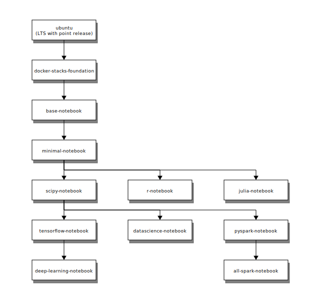

# Selecting an Image

* [Core Stacks](#core-stacks)
* [Image Relationships](#image-relationships)
* [Community Stacks](#community-stacks)

Using one of the Jupyter Docker Stacks requires two choices:

1. Which Docker image you wish to use
2. How you wish to start Docker containers from that image

This section provides details about the first.

## Core Stacks

The Jupyter team maintains a set of Docker image definitions in the [https://github.com/jupyter/docker-stacks](https://github.com/jupyter/docker-stacks) GitHub repository. The following sections describe these images including their contents, relationships, and versioning strategy.

### jupyter/base-notebook

[Source on GitHub](https://github.com/jupyter/docker-stacks/tree/master/base-notebook)
| [Dockerfile commit history](https://github.com/jupyter/docker-stacks/commits/master/base-notebook/Dockerfile)
| [Docker Hub image tags](https://hub.docker.com/r/jupyter/base-notebook/tags/)

`jupyter/base-notebook` is a small image supporting the [options common across all core stacks](common.html). It is the basis for all other stacks.

* Minimally-functional Jupyter Notebook server (e.g., no [pandoc](https://pandoc.org/) for saving notebooks as PDFs)
* [Miniconda](https://conda.io/miniconda.html) Python 3.x in `/opt/conda`
* No preinstalled scientific computing packages
* Unprivileged user `jovyan` (`uid=1000`, configurable, see options) in group `users` (`gid=100`) with ownership over the `/home/jovyan` and `/opt/conda` paths
* `tini` as the container entrypoint and a `start-notebook.sh` script as the default command
* A `start-singleuser.sh` script useful for launching containers in JupyterHub
* A `start.sh` script useful for running alternative commands in the container (e.g. `ipython`, `jupyter kernelgateway`, `jupyter lab`)
* Options for a self-signed HTTPS certificate and passwordless sudo

### jupyter/minimal-notebook

[Source on GitHub](https://github.com/jupyter/docker-stacks/tree/master/minimal-notebook)
| [Dockerfile commit history](https://github.com/jupyter/docker-stacks/commits/master/minimal-notebook/Dockerfile)
| [Docker Hub image tags](https://hub.docker.com/r/jupyter/minimal-notebook/tags/)

`jupyter/minimal-notebook` adds command line tools useful when working in Jupyter applications.

* Everything in `jupyter/base-notebook`
* [Pandoc](http://pandoc.org) and [TeX Live](https://www.tug.org/texlive/) for notebook document conversion
* [git](https://git-scm.com/), [emacs](https://www.gnu.org/software/emacs/), [jed](https://www.jedsoft.org/jed/), [nano](https://www.nano-editor.org/), tzdata, and unzip

### jupyter/r-notebook

[Source on GitHub](https://github.com/jupyter/docker-stacks/tree/master/r-notebook)
| [Dockerfile commit history](https://github.com/jupyter/docker-stacks/commits/master/r-notebook/Dockerfile)
| [Docker Hub image tags](https://hub.docker.com/r/jupyter/r-notebook/tags/)

`jupyter/r-notebook` includes popular packages from the R ecosystem.

* Everything in `jupyter/minimal-notebook` and its ancestor images
* The [R](https://www.r-project.org/) interpreter and base environment
* [IRKernel](https://irkernel.github.io/) to support R code in Jupyter notebooks
* [tidyverse](https://www.tidyverse.org/) packages, including [ggplot2](http://ggplot2.org/), [dplyr](http://dplyr.tidyverse.org/), [tidyr](http://tidyr.tidyverse.org/), [readr](http://readr.tidyverse.org/), [purrr](http://purrr.tidyverse.org/), [tibble](http://tibble.tidyverse.org/), [stringr](http://stringr.tidyverse.org/), [lubridate](http://lubridate.tidyverse.org/), and [broom](https://cran.r-project.org/web/packages/broom/vignettes/broom.html) from [conda-forge](https://conda-forge.github.io/feedstocks)
* [plyr](https://cran.r-project.org/web/packages/plyr/index.html), [devtools](https://cran.r-project.org/web/packages/devtools/index.html), [shiny](https://shiny.rstudio.com/), [rmarkdown](http://rmarkdown.rstudio.com/), [forecast](https://cran.r-project.org/web/packages/forecast/forecast.pdf), [rsqlite](https://cran.r-project.org/web/packages/RSQLite/index.html), [reshape2](https://cran.r-project.org/web/packages/reshape2/reshape2.pdf), [nycflights13](https://cran.r-project.org/web/packages/nycflights13/index.html), [caret](http://topepo.github.io/caret/index.html), [rcurl](https://cran.r-project.org/web/packages/RCurl/index.html), and [randomforest](https://cran.r-project.org/web/packages/randomForest/randomForest.pdf) packages from [conda-forge](https://conda-forge.github.io/feedstocks)

### jupyter/scipy-notebook

[Source on GitHub](https://github.com/jupyter/docker-stacks/tree/master/scipy-notebook)
| [Dockerfile commit history](https://github.com/jupyter/docker-stacks/commits/master/scipy-notebook/Dockerfile)
| [Docker Hub image tags](https://hub.docker.com/r/jupyter/scipy-notebook/tags/)

`jupyter/scipy-notebook` includes popular packages from the scientific Python ecosystem.

* Everything in `jupyter/minimal-notebook` and its ancestor images
* [pandas](https://pandas.pydata.org/), [numexpr](https://github.com/pydata/numexpr), [matplotlib](https://matplotlib.org/), [scipy](https://www.scipy.org/), [seaborn](https://seaborn.pydata.org/), [scikit-learn](http://scikit-learn.org/stable/), [scikit-image](http://scikit-image.org/), [sympy](http://www.sympy.org/en/index.html), [cython](http://cython.org/), [patsy](https://patsy.readthedocs.io/en/latest/), [statsmodel](http://www.statsmodels.org/stable/index.html), [cloudpickle](https://github.com/cloudpipe/cloudpickle), [dill](https://pypi.python.org/pypi/dill), [numba](https://numba.pydata.org/), [bokeh](https://bokeh.pydata.org/en/latest/), [sqlalchemy](https://www.sqlalchemy.org/), [hdf5](http://www.h5py.org/), [vincent](http://vincent.readthedocs.io/en/latest/), [beautifulsoup](https://www.crummy.com/software/BeautifulSoup/), [protobuf](https://developers.google.com/protocol-buffers/docs/pythontutorial), and [xlrd](http://www.python-excel.org/) packages
* [ipywidgets](https://ipywidgets.readthedocs.io/en/stable/) for interactive visualizations in Python notebooks
* [Facets](https://github.com/PAIR-code/facets) for visualizing machine learning datasets

### jupyter/tensorflow-notebook

[Source on GitHub](https://github.com/jupyter/docker-stacks/tree/master/tensorflow-notebook)
| [Dockerfile commit history](https://github.com/jupyter/docker-stacks/commits/master/tensorflow-notebook/Dockerfile)
| [Docker Hub image tags](https://hub.docker.com/r/jupyter/tensorflow-notebook/tags/)

`jupyter/tensorflow-notebook` includes popular Python deep learning libraries.

* Everything in `jupyter/scipy-notebook` and its ancestor images
* [tensorflow](https://www.tensorflow.org/) and [keras](https://keras.io/) machine learning libraries

### jupyter/datascience-notebook

[Source on GitHub](https://github.com/jupyter/docker-stacks/tree/master/datascience-notebook)
| [Dockerfile commit history](https://github.com/jupyter/docker-stacks/commits/master/datascience-notebook/Dockerfile)
| [Docker Hub image tags](https://hub.docker.com/r/jupyter/datascience-notebook/tags/)

`jupyter/datascience-notebook` includes libraries for data analysis from the Julia, Python, and R communities.

* Everything in the `jupyter/scipy-notebook` and `jupyter/r-notebook` images, and their ancestor images
* The [Julia](https://julialang.org/) compiler and base environment
* [IJulia](https://github.com/JuliaLang/IJulia.jl) to support Julia code in Jupyter notebooks
* [HDF5](https://github.com/JuliaIO/HDF5.jl), [Gadfly](http://gadflyjl.org/stable/), and [RDatasets](https://github.com/johnmyleswhite/RDatasets.jl) packages

### jupyter/pyspark-notebook

[Source on GitHub](https://github.com/jupyter/docker-stacks/tree/master/pyspark-notebook)
| [Dockerfile commit history](https://github.com/jupyter/docker-stacks/commits/master/pyspark-notebook/Dockerfile)
| [Docker Hub image tags](https://hub.docker.com/r/jupyter/pyspark-notebook/tags/)

`jupyter/pyspark-notebook` includes Python support for Apache Spark, optionally on Mesos.

* Everything in `jupyter/scipy-notebook` and its ancestor images
* [Apache Spark](https://spark.apache.org/) with Hadoop binaries
* [Mesos](http://mesos.apache.org/) client libraries

### jupyter/all-spark-notebook

[Source on GitHub](https://github.com/jupyter/docker-stacks/tree/master/all-spark-notebook)
| [Dockerfile commit history](https://github.com/jupyter/docker-stacks/commits/master/all-spark-notebook/Dockerfile)
| [Docker Hub image tags](https://hub.docker.com/r/jupyter/all-spark-notebook/tags/)

`jupyter/all-spark-notebook` includes Python, R, and Scala support for Apache Spark, optionally on Mesos.

* Everything in `jupyter/pyspark-notebook` and its ancestor images
* [IRKernel](https://irkernel.github.io/) to support R code in Jupyter notebooks
* [Apache Toree](https://toree.apache.org/) and [spylon-kernel](https://github.com/maxpoint/spylon-kernel) to support Scala code in Jupyter notebooks
* [ggplot2](http://ggplot2.org/), [sparklyr](http://spark.rstudio.com/), and [rcurl](https://cran.r-project.org/web/packages/RCurl/index.html) packages

### Image Relationships

The following diagram depicts the build dependency tree of the core images. (i.e., the `FROM` statements in their Dockerfiles). Any given image inherits the complete content of all ancestor images pointing to it.

### Builds

Pull requests to the `jupyter/docker-stacks` repository trigger builds of all images on Travis CI. These images are for testing purposes only and are not saved for use. When pull requests merge to master, all images rebuild on Docker Cloud and become available to `docker pull` from Docker Hub.

### Versioning

The `latest` tag in each Docker Hub repository tracks the master branch `HEAD` reference on GitHub. `latest` is a moving target, by definition, and will have backward-incompatible changes regularly.

Every image on Docker Hub also receives a 12-character tag which corresponds with the git commit SHA that triggered the image build. You can inspect the state of the `jupyter/docker-stacks` repository for that commit to review the definition of the image (e.g., images with tag 7c45ec67c8e7 were built from [https://github.com/jupyter/docker-stacks/tree/7c45ec67c8e7](https://github.com/jupyter/docker-stacks/tree/7c45ec67c8e7)).

You must refer to git-SHA image tags when stability and reproducibility are important in your work. (e.g. `FROM jupyter/scipy-notebook:7c45ec67c8e7`, `docker run -it --rm jupyter/scipy-notebook:7c45ec67c8e7`). You should only use `latest` when a one-off container instance is acceptable (e.g., you want to briefly try a new library in a notebook).

## Community Stacks

The core stacks are just a tiny sample of what's possible when combining Jupyter with other technologies. We encourage members of the Jupyter community to create their own stacks based on the core images and link them below.

*This list only has 2 examples. You can be the next!*

* [csharp-notebook is a community Jupyter Docker Stack image. Try C# in Jupyter Notebooks](https://github.com/tlinnet/csharp-notebook). The image includes more than 200 Jupyter Notebooks with example C# code and can readily be tried online via mybinder.org. Click here to launch .

* [education-notebook is a community Jupyter Docker Stack image](https://github.com/umsi-mads/education-notebook). The image includes nbgrader and RISE on top of the datascience-notebook image. Click here to launch it on .

See the [contributing guide](../contributing/stacks.html) for information about how to create your own Jupyter Docker Stack.
